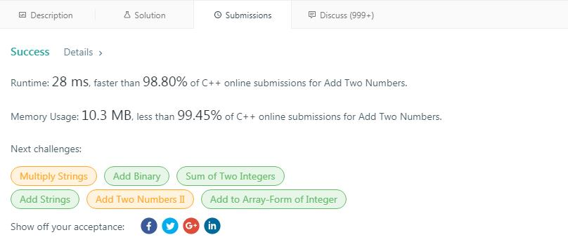

### Algorithm

  虽然之前就听说过LeetCode，但一直没有信心在上面刷题，在网上查了一下，大概有1000道题左右，分为Easy, Medium, Hard三个难度等级，既然耗子哥提要求了，那只能硬着头皮上了。  
  新手嘛，必须从简入难，于是找了两道Easy的题，分别是Two Sum和Reverse Integer。
有一点收获就是看了Two Sum里的Solution有很多利用hash_map来做的，确实是机智，我的方法是先排序，然后移动头尾指针，
来找到符合条件的两个数字，比较麻烦的是还要维护排好序的队列的索引值和原队列的索引
而且时间复杂度为O(nlgn),也要比利用hash_map的O(n)慢。
做完了两道Easy的题，感觉还可以，想着给耗子哥交作业，也不能拿Easy的题来将就，那就选一道Medium（Hard的还是木有信心挑战）的吧，从上到下，选了第二道Add Two Numbers,
这个也没什么难度，感觉主要考察的是对链表的运用和对边界问题的考虑。  
代码很简单，而且还有很多重复代码，等待改进。
#### 代码如下(C++)

    
		class Solution {
    public:
    		ListNode* addTwoNumbers(ListNode* l1, ListNode* l2) {
    			ListNode *ret = NULL, *pos = NULL;
    			int carry = 0;
    			while (l1 != NULL && l2 != NULL)
    			{
    				int result = l1->val + l2->val + carry;
    				if (result >= 10)
    				{
    					result = result % 10;
    					carry = 1;
    				}
    				else 
    				carry = 0;
    				ListNode* node = new ListNode(result);
    				if (ret == NULL) {ret = node; pos = ret;}
    				else
    				{
    					pos->next = node;
    					pos = pos->next;
    				}
    				l1 = l1->next;
    				l2 = l2->next;
    			}
    			ListNode *remain = NULL;
    			if (l1 != NULL) remain = l1;
    			else remain = l2;
    			while (remain != NULL)
    			{
    				int result = carry + remain->val;
    				if (result >= 10)
    				{
    					result = result % 10;
    					carry = 1;
    				}
    				else 
    					carry = 0;
    				ListNode* node = new ListNode(result);
    				pos->next = node;
    				pos = pos->next;
    				remain = remain->next;
    			}
    			if (carry == 1)
    			{
    				ListNode* node = new ListNode(1);
    				pos->next = node;
    				pos = pos->next;
    			}
    			return ret;
    	  }
    };
        

#### 运行结果
虽然代码很简陋，但是运行结果还是很让人欣慰啊(苦笑)

### Review

### Tip

### Share

